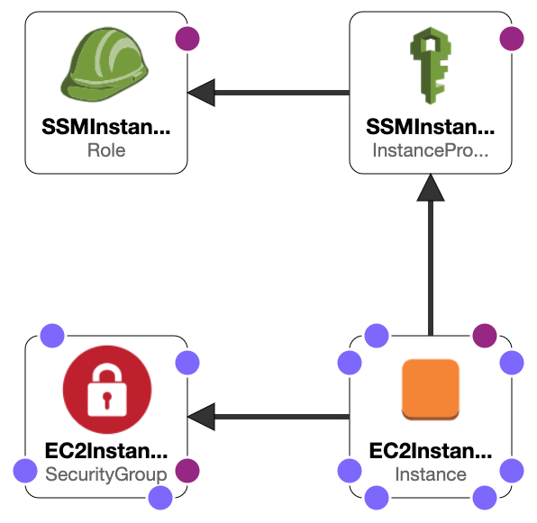

## Single EC2 Instance Linux

[credits](https://000037.awsstudygroup.com/)

### Template documentation

```yaml
AWSTemplateFormatVersion: "2010-09-09"
Description: "Deploy Single EC2 Linux Instance"
```

__AWSTemplateFormatVersion__: Specifies the version of the CloudFormation template. Here, it's set to "2010-09-09", indicating the template format version.

__Description__: Provides a brief description of the template, stating its purpose, which is to deploy a single EC2 Linux instance in this case.

```yaml
Parameters:
  EC2InstanceType:
    AllowedValues:
      - t2.micro
      - t3.nano
      - t3.micro
      - t3.small
      - t3.medium
      - t3.large
      - t3.xlarge
      - t3.2xlarge
      - m5.large
      - m5.xlarge
      - m5.2xlarge
    Default: t2.micro
    Description: Amazon EC2 instance type
    Type: String

  LatestAmiId:
    Type: 'AWS::SSM::Parameter::Value<AWS::EC2::Image::Id>'
    Default: "/aws/service/ami-amazon-linux-latest/amzn2-ami-hvm-x86_64-gp2"
  
  SubnetID:
    Description: ID of a Subnet.
    Type: AWS::EC2::Subnet::Id

  SourceLocation:
    Description : The CIDR IP address range that can be used to RDP to the EC2 instances
    Type: String
    MinLength: 9
    MaxLength: 18
    Default: 0.0.0.0/0
    AllowedPattern: "(\\d{1,3})\\.(\\d{1,3})\\.(\\d{1,3})\\.(\\d{1,3})/(\\d{1,2})"
    ConstraintDescription: must be a valid IP CIDR range of the form x.x.x.x/x.

  VPCID:
    Description: ID of the target VPC (e.g., vpc-0343606e).
    Type: AWS::EC2::VPC::Id
```

__Parameters__: This section defines the input parameters for the template, allowing customization during stack creation. For example:

* __EC2InstanceType__: Specifies the allowed EC2 instance types with a default value of t2.micro.
* __LatestAmiId__: Refers to the latest Amazon Machine Image (AMI) ID for the EC2 instance.
* __SubnetID__: Represents the ID of the subnet where the EC2 instance will be deployed.
* __SourceLocation__: Defines the CIDR IP address range for Remote Desktop Protocol (RDP) access.
* __VPCID__: Refers to the ID of the target Virtual Private Cloud (VPC).

```yaml
Resources:
  EC2InstanceSG:
    Type: AWS::EC2::SecurityGroup
    Properties:
      GroupDescription: EC2 Instance Security Group
      VpcId: !Ref 'VPCID'
      SecurityGroupIngress:
        - IpProtocol: tcp
          FromPort: 80
          ToPort: 80
          CidrIp: !Ref SourceLocation

  SSMInstanceRole:
    Type : AWS::IAM::Role
    Properties:
      Policies:
        - PolicyDocument:
            Version: '2012-10-17'
            Statement:
              - Action:
                  - s3:GetObject
                Resource:
                  - !Sub 'arn:aws:s3:::aws-ssm-${AWS::Region}/*'
                  - !Sub 'arn:aws:s3:::aws-windows-downloads-${AWS::Region}/*'
                  - !Sub 'arn:aws:s3:::amazon-ssm-${AWS::Region}/*'
                  - !Sub 'arn:aws:s3:::amazon-ssm-packages-${AWS::Region}/*'
                  - !Sub 'arn:aws:s3:::${AWS::Region}-birdwatcher-prod/*'
                  - !Sub 'arn:aws:s3:::patch-baseline-snapshot-${AWS::Region}/*'
                Effect: Allow
          PolicyName: ssm-custom-s3-policy
      Path: /
      ManagedPolicyArns:
        - !Sub 'arn:${AWS::Partition}:iam::aws:policy/AmazonSSMManagedInstanceCore'
        - !Sub 'arn:${AWS::Partition}:iam::aws:policy/CloudWatchAgentServerPolicy'
      AssumeRolePolicyDocument:
        Version: "2012-10-17"
        Statement:
          - Effect: "Allow"
            Principal:
              Service:
              - "ec2.amazonaws.com"
              - "ssm.amazonaws.com"
            Action: "sts:AssumeRole"

  SSMInstanceProfile:
    Type: "AWS::IAM::InstanceProfile"
    Properties:
      Roles:
        - !Ref SSMInstanceRole

  EC2Instance:
    Type: "AWS::EC2::Instance"
    Properties:
      ImageId: !Ref LatestAmiId
      InstanceType: !Ref EC2InstanceType
      IamInstanceProfile: !Ref SSMInstanceProfile
      NetworkInterfaces:
        - DeleteOnTermination: true
          DeviceIndex: '0'
          SubnetId: !Ref 'SubnetID'
          GroupSet:
            - !Ref EC2InstanceSG
      Tags:
        - Key: "Name"
          Value: "MGMT312-EC2"
```

__Resources__: This section defines the AWS resources to be created by the CloudFormation stack. Here are some key resources:

* __EC2InstanceSG__: Creates an EC2 Security Group allowing inbound traffic on port 80 from the specified CIDR range.
* __SSMInstanceRole__: Defines an IAM Role with policies for S3 access and permissions for EC2 and SSM.
* __SSMInstanceProfile__: Establishes an IAM Instance Profile associated with the SSMInstanceRole.
* __EC2Instance__: Specifies the EC2 instance to be launched with properties such as AMI, instance type, and associated security groups.

```yaml
Outputs:
  EC2InstancePrivateIP:
    Value: !GetAtt 'EC2Instance.PrivateIp'
    Description: Private IP for EC2 Instances
```

__Outputs__: This section specifies the information or results that will be displayed after the CloudFormation stack is created. In this case, it provides the private IP address of the EC2 instance.

[Code](/singlec2instance)

### Deploy Stack

```
bash create-stack.sh

```

Returns:

```json
{
    "StackId": "arn:aws:cloudformation:<Region>:<Account ID>:stack/asg-cloudformation-stack/<Unique Identifier>"
}
```

### Destroy Stack

```
bash delete-stack.sh

```

### Visual representation


